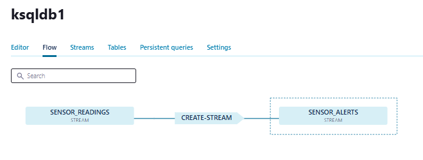
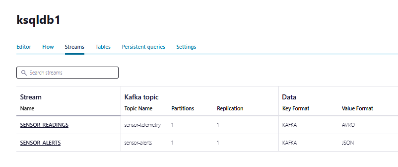
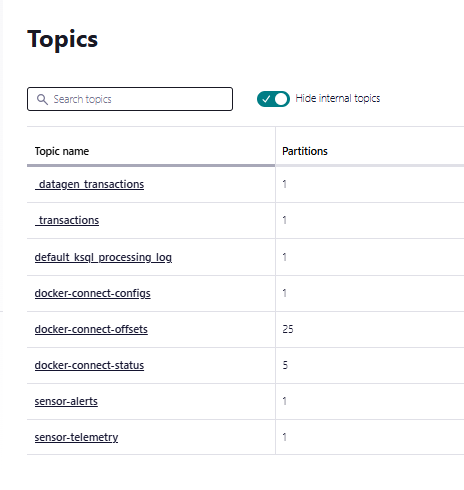

# Tarea - Entorno Kafka Streaming

## Descripción del Entorno

 El sistema está diseñado para el procesamiento de datos en tiempo real de FarmIA, incluyendo telemetría de sensores y transacciones de ventas.

## Arquitectura del Sistema Kafka as-is: 

### Componentes Principales

```
┌─────────────────────────────────────────────────────┐
│                    KAFKA CLUSTER                    │
│                                                     │
│  ┌─────────────┐  ┌─────────────┐  ┌─────────────┐  │
│  │Controller-1 │  │Controller-2 │  │Controller-3 │  │
│  │   :9095     │  │   :9096     │  │   :9097     │  │
│  └─────────────┘  └─────────────┘  └─────────────┘  │
│                                                     │
│  ┌─────────────┐  ┌─────────────┐  ┌─────────────┐  │
│  │  Broker-1   │  │  Broker-2   │  │  Broker-3   │  │
│  │   :9092     │  │   :9093     │  │   :9094     │  │
│  └─────────────┘  └─────────────┘  └─────────────┘  |
└─────────────────────────────────────────────────────┘
                                  │
                                  ▼
┌───────────────────────────────────────────────────────────┐
│                   CONFLUENT ECOSYSTEM                     │
│                                                           │
│  ┌────────────────┐  ┌──────────────┐  ┌──────────────┐   │
│  │Schema Registry │  │Kafka Connect │  │ KsqlDB Server│   │
│  │    :8081       │  │    :8083     │  │    :8088     │   │
│  └──────────v─────┘  └──────────────┘  └──────────────┘   │
│                                                           │
│  ┌──────────────┐  ┌──────────────┐                       │
│  │Control Center│  │  KsqlDB CLI  │                       │
│  │    :9021     │  │              │                       │
│  └──────────────┘  └──────────────┘                       │
└───────────────────────────────────────────────────────────┘
                                  │
                                  ▼
┌─────────────────────────────────────────┐
│               DATA STORAGE              │
│                                         │
│  ┌──────────────┐  ┌──────────────┐     │
│  │    MySQL     │  │  phpMyAdmin  │     │
│  │    :3306     │  │    :8080     │     │
│  └──────────────┘  └──────────────┘     │
└─────────────────────────────────────────┘


┌────────────────────────┐
│      DATA LAYER        │
│                        │
│  ┌──────────────┐      │
│  │    DataGen   |      |
|  |   Connector  |      │
│  └──────────────┘      │
└────────────────────────┘
```

### Detalles de Arquitectura


- **Controllers**: 3 nodos dedicados para metadatos y coordinación
  - Quorum distribuido para alta disponibilidad
  - Cluster ID: `Nk018hRAQFytWskYqtQduw`
- **Brokers**: 3 nodos para almacenamiento y distribución de mensajes
  - Replicación configurada para tolerancia a fallos
  - Load balancing automático

#### **Confluent Platform Services**
- **Schema Registry**: Gestión centralizada de esquemas Avro
- **Kafka Connect**: Integración con sistemas externos
- **KsqlDB**: Procesamiento de streams en tiempo real
- **Control Center**: Monitoreo y gestión del cluster

#### **Persistencia de Datos**
- **MySQL 8.3**: Base de datos transaccional
- **phpMyAdmin**: Interfaz web para administración

## Enlaces de Servicios

### Servicios Web
- **Confluent Control Center**: [http://localhost:9021](http://localhost:9021)
- **Schema Registry**: [http://localhost:8081](http://localhost:8081)
- **Kafka Connect**: [http://localhost:8083](http://localhost:8083)
- **KsqlDB Server**: [http://localhost:8088](http://localhost:8088)
- **phpMyAdmin**: [http://localhost:8080](http://localhost:8080)

### Endpoints Kafka
- **Broker-1**: `localhost:9092`
- **Broker-2**: `localhost:9093`
- **Broker-3**: `localhost:9094`

### Base de Datos
- **MySQL**: `localhost:3306`
  - Usuario: `root` / Password: `password`
  - Base de datos: `db`
  - Usuario aplicación: `user` / Password: `password`

## Flujo de Datos

### Conectores Implementados
1. **source-datagen-_transactions**: Genera transacciones sintéticas
2. **sink-mysql-_transactions**: Almacena transacciones en MySQL

### Conectores a Desarrollar
1. **source-datagen-sensor-telemetry**: Telemetría de sensores IoT
2. **source-mysql-transactions**: Lectura incremental de transacciones

### Streams Processing
- **SalesSummaryApp**: Agregación de ventas por ubicación
- **SensorAlerterApp**: Alertas basadas en telemetría


*******************************************************************************************
*******************************************************************************************

## Creacion del DataGen sensor-telemetry: 
1. Definicion en source-datagen-sensor-telemetry
2. Schema en sensor-telemtry.avsc

## Alarma: 

He creado con exito la alarma que nos informa cuando la temperatura sea superior a 35grados o la humedad por debajo de 20%. 






El codigo de alarma Ksql esta en el archivo: sensor-telemetry-alarm.sql

## Conector MySQL Source - Transacciones de Ventas

Se ha implementado exitosamente el conector **source-mysql-transactions** que lee de la base de datos y publica en el topic sensor_transactions. Para poder crear el stream Sales-source-stram que más tarde publicará la sumarización de las ventas en el topic sales-summary.

## Summarizacion de ventas por minuto

Para realizar esto, primero hemos creado una stream "sales_source_stream, para leer datos del topic sales_transactions, despues la tabla: sales_summary_by_group donde se realiza la salida agrupacion por categorias de productos y total vendido y total ingresado. Después se publica el resultado en el topic: sales-summary.


